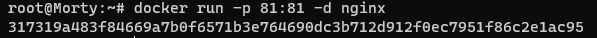

## Part 1. Готовый докер
---
В качестве конечной цели своей небольшой практики вы сразу выбрали написание докер образа для собственного веб сервера, а потому в начале вам нужно разобраться с уже готовым докер образом для сервера.
Ваш выбор пал на довольно простой __nginx__.  

__= = Задание = =__  

#### Взять официальный докер образ с __nginx__ и выкачать его при помощи docker pull  

- Выполняем команду `docker pull nginx`  

- скрин с установкой образа:  
  

#### Проверить наличие докер образа через docker images  

- Выполняем команду `docker images`  

- скрин с выводом списка образов:  
  

#### Запустить докер образ через docker run -d [image_id|repository]  

- Выполняем команду `docker run -d nginx`  

- скрин подверждающий запуск контейнера:  
  

#### Проверить, что образ запустился через docker ps  

- Выполняем команду `docker ps`  

- скрин с выводом всех запущенных контейнеров:  
  

#### Посмотреть информацию о контейнере через docker inspect [container_id|container_name]  

- Выполняем команду `docker inspect b3664f0109d8`  

- скрин с информацией о контейнере:  
  

#### По выводу команды определить и поместить в отчёт размер контейнера, список замапленных портов и список замапленных портов  

- на скринах порт и ip адресс контейнера:  

 
 

- на скрине виден размер:  

  

- размер контейнера         - 187MB 
- список замапленных портов - "80/tcp": null
- список замапленных портов - 172.17.0.3  

#### Остановить докер образ через docker stop [container_id|container_name]  

- Выполняем команду `docker stop b3664f0109d8`  
 

#### Проверить, что образ остановился через docker ps  

- Выполняем команду `docker ps`
-     

#### Запустить докер с замапленными портами 80 и 443 на локальную машину через команду run  

- Выполняем команду `docker run -d -p 80:80 -p 443:443 nginx` 

- скрин подверждающий запуск контейнера с замаплненными портами:  
  

#### Проверить, что в браузере по адресу localhost:80 доступна стартовая страница nginx 

- скрин с проверкой доступности странички по адресу localhost:80 в ОС:  
  

#### Перезапустить докер контейнер через docker restart [container_id|container_name]  

- Выполняем команду `docker restart`  

- скрин подверждающий выполнение перезапуска контейнера:  
  

#### Проверить любым способом, что контейнер запустился  

- Выполняем команду `curl localhost:80` 

- скрин с успешно отданным ответом:  
  

## Part 2. Операции с контейнером
---
Докер образ и контейнер готовы. Теперь можно покопаться в конфигурации __nginx__ и отобразить статус страницы.

__== Задание = =__

#### Прочитать конфигурационный файл nginx.conf внутри докер образа через команду exec  

- Выполняем команду:  
- `sudo docker exec 9bb7b5d44cle cat etc/nginx/nginx.conf`  

  

#### Создать на локальной машине файл nginx.conf  

- выполняем команду копирования файла nginx.conf из контейнера в хост:  
`sudo docker exec 9bb7b5d44cle cat etc/nginx/nginx.conf > src/data/nginx.conf`

#### Настроить в нем по пути */status* отдачу страницы статуса сервера __nginx__   

#### Скопировать созданный файл *nginx.conf* внутрь докер образа через команду docker cp  

- Выполняем команду `sudo docker cp data/nginx.conf 9bb7b5d44cle:etc/nginx/nginx.conf` 

#### Перезапустить nginx внутри докер образа через команду exec  

- Выполняем команду `sudo docker exec 9bb7b5d44cle nginx -s reload`

#### Проверить, что по адресу localhost:80/status отдается страничка со статусом сервера nginx  

- Выполняем команду `curl localhost:80/status`  

- скрин с копированием файла nginx.conf в контейнер, перезагрузкой контейнера и проверкой работоспособности странички /status:  
   

#### Экспортировать контейнер в файл *container.tar* через команду *export*

- Выполняем команду `sudo docker container export 9bb7b5d44cle > data/container.tar`
  
#### Остановить контейнер  

- Выполняем команду `sudo docker stop 9bb7b5d44cle`
  
#### Удалить образ, не удаляя перед этим контейнеры  

- Выполняем команду `sudo docker rmi -f [image_id|repository]`   

 

#### Импортировать контейнер обратно через команду *import*  

- Выполняем команду  `docker import data/container.tar cmonte_img` 

##### Запустить импортированный контейнер  

- `sudo docker run -itd --name imported -p 81:81 -d nginx`
-  
- `docker exec 317319a483f8 service nginx reload`
  

- `curl localhost:80/status`  

- `curl localhost:80` 
- 
